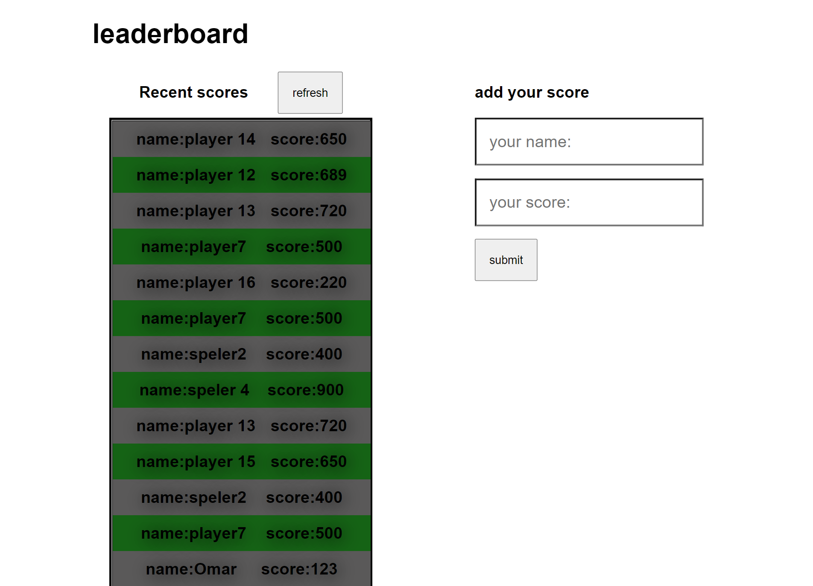

# Project Name

> Leaderboard project

A leaderboard web app that uses the leaderboard API to save leaderboard ranking.

## Built With

- HTML
- CSS
- Webpack
- NPM

## Live Demo

[Live Demo Link](https://timowest12.github.io/Leaderboard/)

## Getting Started

If you want to use this repo as a template, you can do so; follow the instructions below.

### Usage

Download it directly by ZIP, open the index file in a text editor, and you can change the content to match your own.
CD into the root folder and run npm i(NodeJs and NPM required)
run npm start to launch project on local server

## Authors

👤 **Author1**

- GitHub: [@githubhandle](https://github.com/Timowest12)
- Twitter: [@twitterhandle](https://twitter.com/Timo61060367)
- LinkedIn: [LinkedIn](https://www.linkedin.com/in/timo-wester-6a0282a7/)

## 🤝 Contributing

Contributions, issues, and feature requests are welcome!

Feel free to check the [issues page](../../issues/).

## Show your support

Give a ⭐️ if you like this project!

## 📝 License

This project is [MIT](./MIT.md) licensed.
